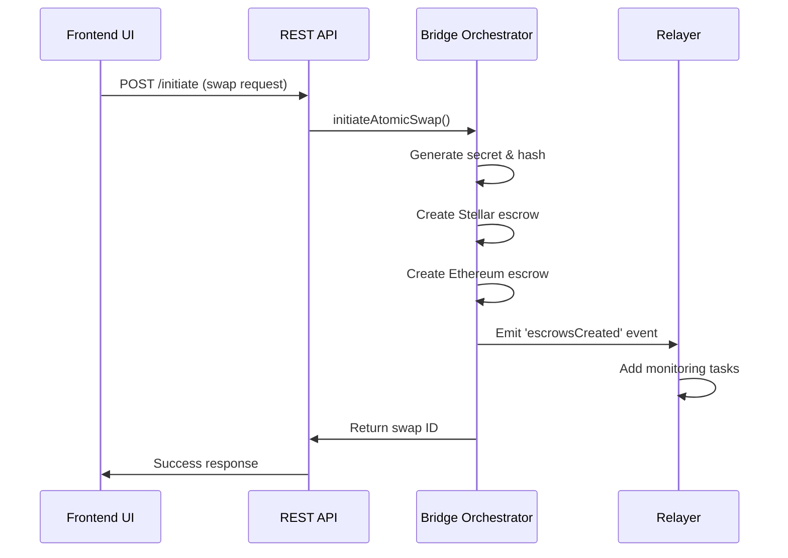
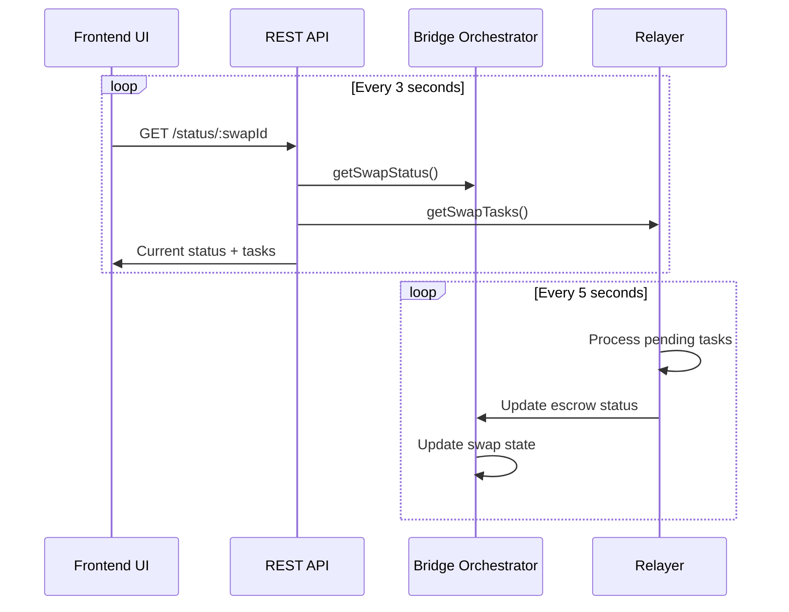
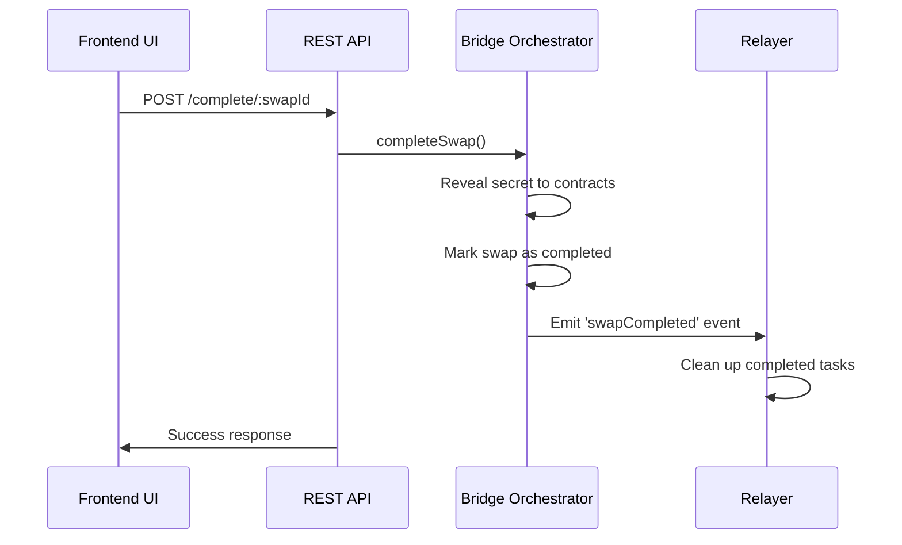

# Atomic Swap Implementation Guide

This document explains the atomic swap implementation in the test-hydra project, providing a comprehensive overview of the cross-chain HTLC (Hash Time Locked Contract) system.

## 🏗️ Architecture Overview

The atomic swap system consists of three main components:

1. **Bridge Orchestrator** - Coordinates cross-chain atomic swaps
2. **Relayer System** - Monitors and facilitates swap operations
3. **Frontend Interface** - User interface for atomic swap operations

```
┌─────────────────┐    ┌─────────────────┐    ┌─────────────────┐
│   Frontend UI   │◄──►│ Bridge Orch.    │◄──►│ Relayer System  │
│   (React)       │    │ (Coordinator)   │    │ (Task Queue)    │
└─────────────────┘    └─────────────────┘    └─────────────────┘
         │                       │                       │
         │                       ▼                       ▼
         └──────────────► REST API ◄─────────── Event System
                              │
                              ▼
                    ┌─────────────────┐
                    │   Database      │
                    │   (Swap State)  │
                    └─────────────────┘
```

## 📁 File Structure

### Backend Components

```
server/
├── src/
│   ├── bridge-orchestrator.ts    # Main orchestration logic
│   └── relayer.ts                # Task-based relayer system
├── routes/
│   └── atomic-swap.ts            # REST API endpoints
└── routes.ts                     # Route registration
```

### Frontend Components

```
client/src/
├── hooks/
│   └── use-atomic-swap.ts        # React hooks for API integration
├── components/
│   └── atomic-swap-interface.tsx # Main UI component
└── pages/
    └── bridge.tsx                # Updated bridge page with tabs
```

## 🔧 Backend Implementation

### 1. Bridge Orchestrator (`server/src/bridge-orchestrator.ts`)

The Bridge Orchestrator is the central coordinator for atomic swaps.

**Key Features:**
- Manages atomic swap lifecycle
- Creates and monitors escrows on both chains
- Handles secret generation and verification
- Emits events for relayer coordination

**Core Methods:**
```typescript
class BridgeOrchestrator extends EventEmitter {
  async initiateAtomicSwap(request: AtomicSwapRequest): Promise<string>
  async createStellarEscrow(swapId: string, details: any): Promise<EscrowDetails>
  async createEthereumEscrow(swapId: string, details: any): Promise<EscrowDetails>
  async completeSwap(swapId: string): Promise<void>
  async refundSwap(swapId: string): Promise<void>
  getSwapStatus(swapId: string): AtomicSwapState | undefined
}
```

**Swap States:**
- `initiated` - Swap request received
- `escrows_created` - Both escrows created
- `escrows_locked` - Funds locked in escrows
- `completed` - Swap successfully completed
- `failed` - Swap failed
- `refunded` - Swap refunded

### 2. Relayer System (`server/src/relayer.ts`)

The Relayer monitors and processes atomic swap tasks.

**Key Features:**
- Event-driven task queue system
- Automatic retry logic with exponential backoff
- Priority-based task processing
- Performance metrics and monitoring

**Task Types:**
- `create_escrow` - Create escrow contracts
- `lock_escrow` - Lock funds in escrows
- `reveal_secret` - Reveal hash preimage
- `complete_escrow` - Complete the swap
- `refund_escrow` - Refund timed-out swaps

**Task Processing:**
```typescript
class AtomicSwapRelayer extends EventEmitter {
  addTask(type, swapId, chain, data, priority, delay): string
  private async processTask(task: RelayTask): Promise<void>
  getMetrics(): RelayerMetrics
  getHealthStatus(): HealthStatus
}
```

### 3. REST API (`server/routes/atomic-swap.ts`)

Complete API for atomic swap operations:

```typescript
POST   /api/atomic-swap/initiate      # Initiate new atomic swap
GET    /api/atomic-swap/status/:id    # Get swap status
GET    /api/atomic-swap/all           # Get all swaps
POST   /api/atomic-swap/complete/:id  # Complete swap (testing)
POST   /api/atomic-swap/refund/:id    # Refund swap
GET    /api/atomic-swap/health        # System health check
GET    /api/atomic-swap/simulate      # Simulation for testing
GET    /api/atomic-swap/relayer/metrics # Relayer performance
```

## 🎨 Frontend Implementation

### 1. React Hooks (`client/src/hooks/use-atomic-swap.ts`)

Custom hooks for atomic swap functionality:

```typescript
// Main atomic swap operations
const {
  initiateSwap,
  isInitiating,
  completeSwap,
  refundSwap,
  activeSwapId
} = useAtomicSwap();

// Real-time status monitoring with polling
const { data: swapStatus } = useAtomicSwapStatus(swapId, enabled);

// Get all swaps history
const { data: allSwaps } = useAtomicSwaps();

// Monitor relayer performance
const { data: metrics } = useRelayerMetrics();

// System health monitoring
const { data: health } = useAtomicSwapHealth();
```

### 2. UI Component (`client/src/components/atomic-swap-interface.tsx`)

Complete atomic swap interface with:

**Features:**
- Cross-chain token selection (Stellar ↔ Ethereum)
- Amount input with balance display
- Timelock configuration
- Real-time progress tracking
- Escrow status monitoring
- Relayer task visualization
- Action buttons (Complete/Refund)
- Error handling and user feedback

**UI Sections:**
```typescript
// Main swap interface
<Card> // From/To token selection with chain switching
<Card> // Active swap status with progress bar
<Card> // Relayer metrics display
<Card> // Recent swaps history
```

### 3. Updated Bridge Page (`client/src/pages/bridge.tsx`)

Enhanced bridge page with tabbed interface:

```tsx
<Tabs defaultValue="bridge">
  <TabsTrigger value="bridge">🌉 Standard Bridge</TabsTrigger>
  <TabsTrigger value="atomic-swap">🔐 Atomic Swap</TabsTrigger>
  
  <TabsContent value="bridge">
    <BridgeInterface /> {/* Existing 1inch Fusion+ */}
  </TabsContent>
  
  <TabsContent value="atomic-swap">
    <AtomicSwapInterface /> {/* New atomic swap UI */}
  </TabsContent>
</Tabs>
```

## 🔄 Process Flow

### 1. Atomic Swap Initiation



### 2. Real-time Monitoring



### 3. Swap Completion



## 🧪 Testing

### API Testing

The project includes a comprehensive test script:

```bash
# Run API tests
node test-atomic-swap-api.js
```

**Test Coverage:**
- ✅ Health endpoint
- ✅ Simulation endpoint
- ✅ Swap initiation
- ✅ Status monitoring
- ✅ Relayer metrics
- ✅ All swaps listing

### Manual Testing

1. **Start the development server:**
   ```bash
   npm run dev
   ```

2. **Access the frontend:**
   - Navigate to `http://localhost:3000`
   - Click on "🔐 Atomic Swap" tab

3. **Test atomic swap flow:**
   - Select tokens and chains
   - Enter amount
   - Click "Initiate Atomic Swap"
   - Monitor real-time progress
   - Use Complete/Refund buttons for testing

## 🔧 Configuration

### Environment Variables

```env
NODE_ENV=development
PORT=3000
FUSION_API_KEY=your_fusion_api_key
```

### Network Configuration

The system supports:
- **Stellar Network:** Testnet/Mainnet
- **Ethereum Network:** Sepolia/Mainnet

### Relayer Configuration

```typescript
const config: RelayerConfig = {
  monitoringInterval: 5000,    // 5 seconds
  retryAttempts: 3,
  retryDelay: 10000,          // 10 seconds
  enableAutoRelay: true,
  gasLimitMultiplier: 1.2
};
```

## 🚀 Deployment

### Smart Contract Deployment Status

#### ✅ Ethereum Contracts (Sepolia Testnet)

**StellarEthereumEscrow Contract:**
- **Address:** `0x58bF6ae705E32D532c3A39DeeC4Fb4fCFAfdED03`
- **Network:** Sepolia (Chain ID: 11155111)
- **Transaction:** `0xe3b2f5f62a1b0978689d6c103027ce378272ccded870c8b41eb043999c5a0bd8`
- **Explorer:** [View on Sepolia Etherscan](https://sepolia.etherscan.io/address/0x58bF6ae705E32D532c3A39DeeC4Fb4fCFAfdED03)
- **Deployed:** 2025-08-03T13:12:37.836Z
- **Gas Used:** 1,189,354

#### 🔨 Stellar Contracts (Ready for Deployment)

**StellarEthEscrow Contract:**
- **WASM Hash:** `78418d94f99de09c1c7efd552b57e66aaafb441187acd0f563260a61e715af19`
- **WASM File:** `target/wasm32v1-none/release/stellar_eth_escrow.wasm`
- **Network:** Stellar Testnet
- **Status:** Built and ready for deployment
- **Build Tool:** Stellar CLI v22.8.2
- **Exported Functions:** initialize, create_escrow, lock_escrow, complete_escrow, refund_escrow, get_escrow, get_escrows_by_maker, get_stats

**Deployment Command (when network is available):**
```bash
cd contracts-stellar/stellar-eth-escrow
stellar contract deploy \
  --wasm ../target/wasm32v1-none/release/stellar_eth_escrow.wasm \
  --source alice \
  --network testnet
```

### Bridge Orchestrator Configuration

Once contracts are deployed, update the bridge orchestrator:

```typescript
// server/src/bridge-orchestrator.ts
const ETHEREUM_CONTRACT_ADDRESS = "0x58bF6ae705E32D532c3A39DeeC4Fb4fCFAfdED03";
const STELLAR_CONTRACT_ID = "DEPLOYED_CONTRACT_ID"; // To be updated after deployment
```

### Development

```bash
# Install dependencies
npm install

# Start development server
npm run dev

# Run relayer separately (optional)
npm run relayer:dev
```

### Production

```bash
# Build the project
npm run build

# Start production server
npm start

# Start production relayer
npm run relayer:prod
```

## 🔐 Security Considerations

### 1. Hash Time Locked Contracts (HTLC)

- **Secret Management:** Cryptographically secure random secrets
- **Hash Functions:** SHA-256 for cross-chain compatibility
- **Timelock Protection:** Automatic refund after expiration

### 2. Cross-Chain Security

- **Atomic Properties:** Either both sides complete or both fail
- **No Trusted Third Party:** Fully decentralized execution
- **Replay Protection:** Unique swap IDs and nonces

### 3. API Security

- **Input Validation:** Comprehensive request validation
- **Rate Limiting:** Built-in request throttling
- **Error Handling:** Secure error messages without data leakage

## 🔧 Troubleshooting

### Common Issues

1. **"Ethereum contract not initialized"**
   - This is expected in MVP mode
   - Deploy contracts to resolve

2. **Relayer not processing tasks**
   - Check relayer health endpoint
   - Verify event emissions from orchestrator

3. **Frontend not updating**
   - Verify API connectivity
   - Check browser console for errors

### Debug Commands

```bash
# Check relayer health
curl http://localhost:3000/api/atomic-swap/health

# Get relayer metrics
curl http://localhost:3000/api/atomic-swap/relayer/metrics

# Simulate atomic swap
curl http://localhost:3000/api/atomic-swap/simulate
```

## 🎯 Next Steps

### 1. Contract Deployment

- ✅ **Ethereum Contract Deployed:** StellarEthereumEscrow on Sepolia testnet
- 🔨 **Stellar Contract Ready:** Built and ready for deployment when network is available
- 🔄 **Update orchestrator:** Configure with deployed contract addresses once Stellar deployment completes

### 2. Enhanced Features

- Multi-signature support
- Fee estimation
- Slippage protection
- Cross-chain price oracles

### 3. Production Readiness

- Comprehensive test suite
- Error monitoring
- Performance optimization
- Security audit

## 📊 Performance Metrics

The system tracks comprehensive metrics:

- **Success Rate:** Percentage of successful swaps
- **Average Execution Time:** Mean task processing time
- **Queue Status:** Real-time task queue monitoring
- **Chain Health:** Network connectivity status

## 🤝 Contributing

When contributing to the atomic swap system:

1. Maintain event-driven architecture
2. Add comprehensive error handling
3. Include real-time UI updates
4. Write API tests for new endpoints
5. Update this documentation

---

**Note:** This implementation provides a complete MVP for atomic swaps with a focus on robust architecture, real-time monitoring, and user experience. The system is designed to be production-ready once smart contracts are deployed.