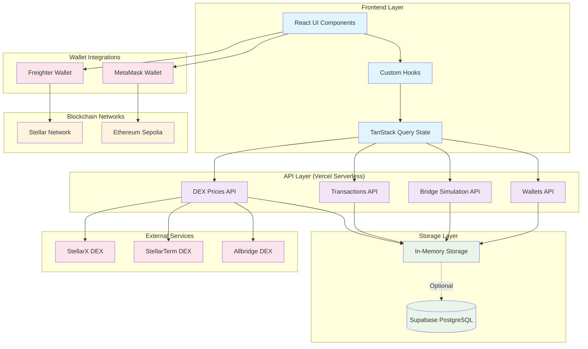
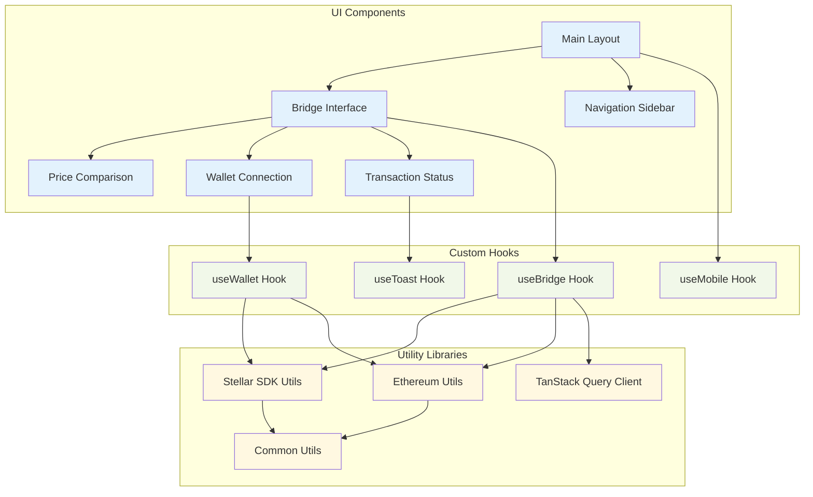
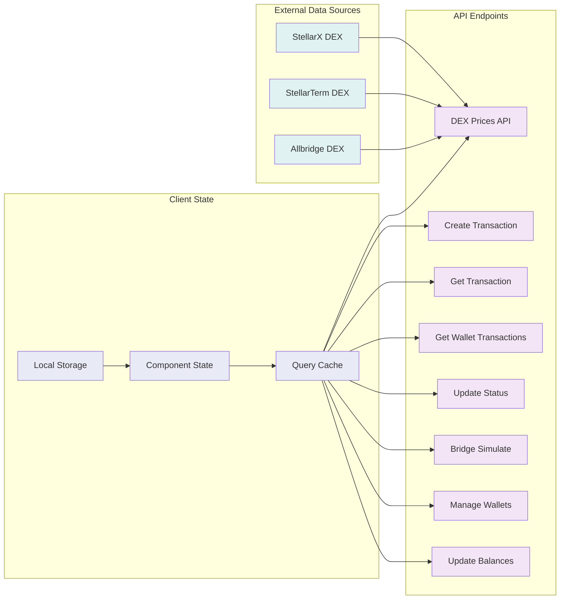
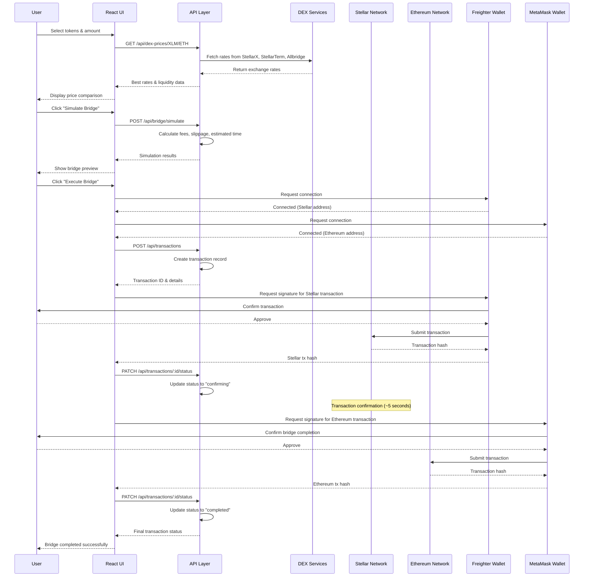
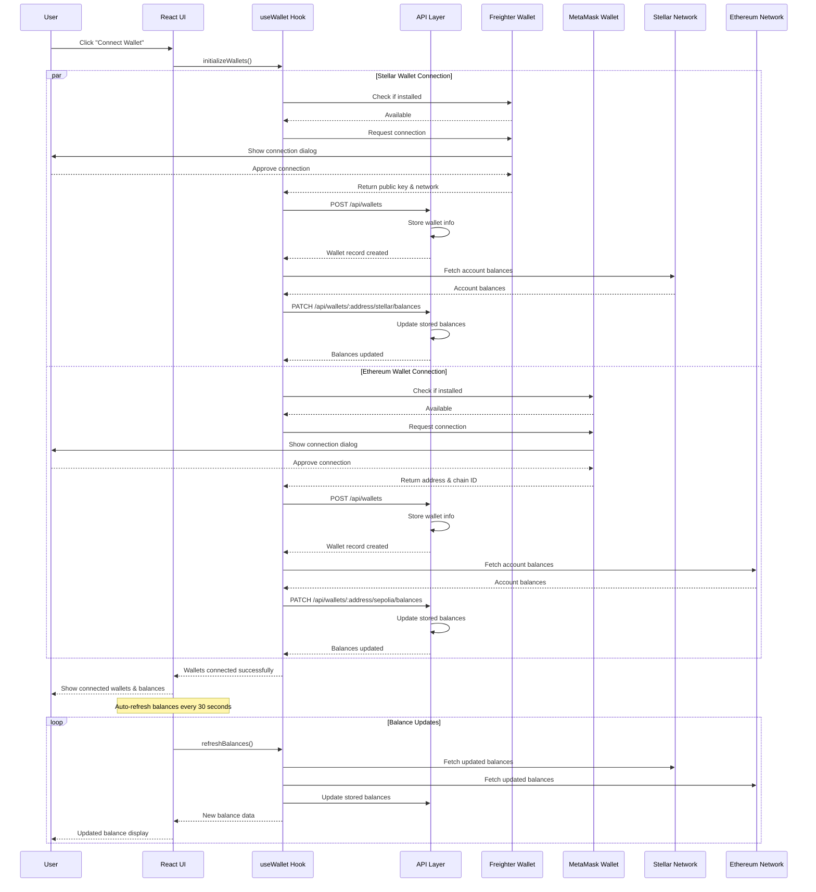
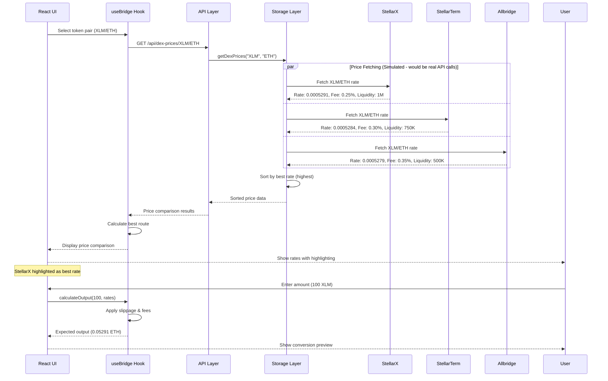
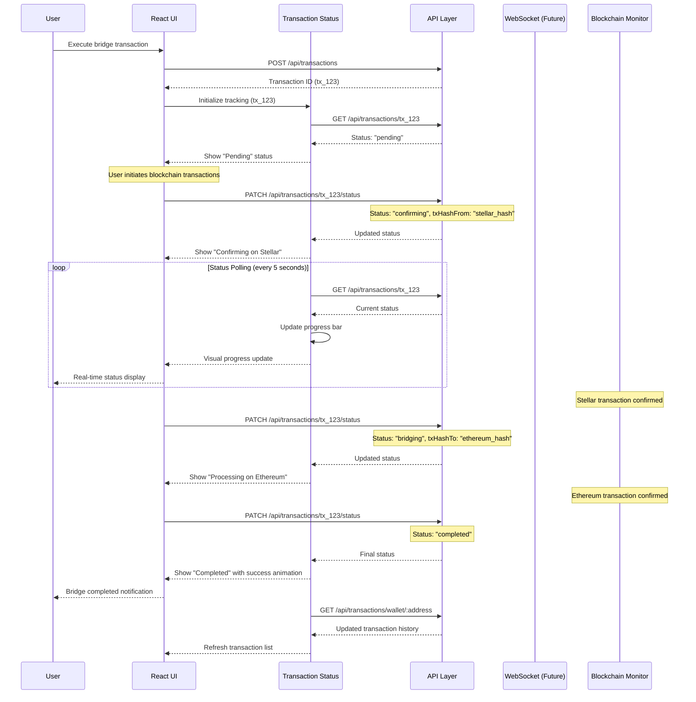
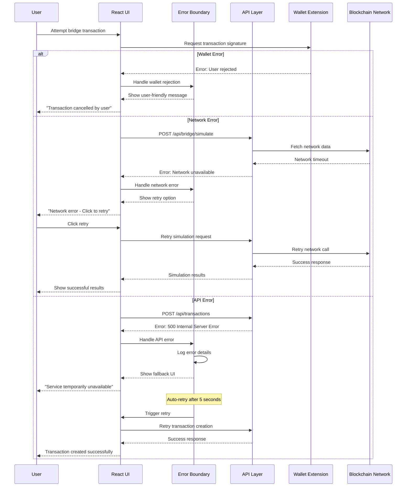
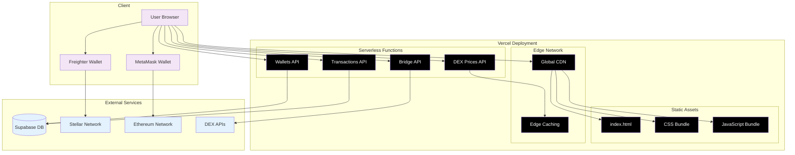

# StellHydra - Stellar to Sepolia ETH Bridge DEX Aggregator

A modern, full-stack cross-chain bridge application that enables seamless token transfers between the Stellar and Ethereum (Sepolia testnet) networks with real-time DEX price aggregation.

## 🌟 Features

- **Cross-Chain Bridge**: Seamlessly bridge tokens between Stellar and Sepolia networks
- **DEX Aggregation**: Real-time price comparison from multiple DEXs (StellarX, StellarTerm, Allbridge)
- **Dual Wallet Support**: Connect both Stellar (Freighter) and Ethereum (MetaMask) wallets
- **Real-time Updates**: Live transaction status tracking and balance updates
- **Modern UI**: Dark-themed interface with glass morphism design
- **Mobile Responsive**: Optimized for both desktop and mobile devices
- **Transaction History**: Complete transaction tracking with status updates

## 🚀 Tech Stack

### Frontend
- **React 18** with TypeScript
- **Tailwind CSS** for styling
- **Shadcn/UI** component library
- **TanStack Query** for state management
- **Wouter** for lightweight routing
- **Framer Motion** for animations

### Backend
- **Express.js** with TypeScript
- **Drizzle ORM** with PostgreSQL support
- **Zod** for schema validation
- **In-memory storage** (easily swappable with database)

### Blockchain Integration
- **Stellar SDK** for Stellar network interactions
- **Web3/Ethers** for Ethereum Sepolia testnet
- **Freighter Wallet** integration for Stellar
- **MetaMask** integration for Ethereum

## 🛠️ Installation

1. **Clone the repository**
   ```bash
   git clone https://github.com/JulioMCruz/StellHydra.git
   cd StellHydra
   ```

2. **Install dependencies**
   ```bash
   npm install
   ```

3. **Set up environment variables**
   ```bash
   # Copy environment template
   cp .env.example .env
   
   # Add your configuration
   DATABASE_URL=your_postgresql_url_here
   NODE_ENV=development
   ```

4. **Start the development server**
   ```bash
   npm run dev
   ```

The application will be available at `http://localhost:5000`

## 🔧 Configuration

### Supported Networks
- **Stellar Mainnet** - For production use
- **Stellar Testnet** - For development/testing
- **Ethereum Sepolia** - Testnet for Ethereum integration

### Supported Wallets
- **Freighter** - Stellar wallet extension
- **MetaMask** - Ethereum wallet extension

## 📱 Usage

1. **Connect Wallets**: Click "Connect Wallet" to connect both Stellar and Sepolia wallets
2. **Select Tokens**: Choose source and destination tokens using the dropdown selectors
3. **Enter Amount**: Input the amount you want to bridge
4. **Review Quote**: Check the real-time price quote and fees
5. **Execute Bridge**: Click "Bridge Tokens" to initiate the cross-chain transaction
6. **Track Status**: Monitor your transaction progress in the activity panel

## 🏗️ Architecture

### System Architecture Overview



### Component Architecture



### Data Flow Architecture



### Project Structure
```
├── client/                 # Frontend React application
│   ├── src/
│   │   ├── components/     # Reusable UI components
│   │   ├── hooks/          # Custom React hooks
│   │   ├── lib/            # Utility libraries
│   │   └── pages/          # Application pages
├── api/                    # Vercel Serverless Functions
│   ├── _lib/              # Shared utilities
│   ├── dex-prices/        # DEX price endpoints
│   ├── transactions/      # Transaction endpoints
│   ├── bridge/            # Bridge simulation
│   └── wallets/           # Wallet management
├── server/                 # Legacy Express server (local dev)
├── shared/                 # Shared types and schemas
└── components.json         # Shadcn/UI configuration
```

## 🔗 API Endpoints

### DEX Prices
- `GET /api/dex-prices/:fromToken/:toToken` - Get current exchange rates

### Transactions
- `POST /api/transactions` - Create new bridge transaction
- `GET /api/transactions/:id` - Get transaction details
- `GET /api/transactions/wallet/:address` - Get wallet transactions
- `PATCH /api/transactions/:id/status` - Update transaction status

### Bridge Simulation
- `POST /api/bridge/simulate` - Simulate bridge transaction

### Wallets
- `POST /api/wallets` - Create or update wallet
- `PATCH /api/wallets/:address/:network/balances` - Update wallet balances

## 🔄 Sequence Diagrams

### Cross-Chain Bridge Transaction Flow



### Wallet Connection & Balance Management Flow



### DEX Price Aggregation Flow



### Transaction Status Tracking Flow



### Error Handling & Recovery Flow



## 🌐 Deployment

### Development
```bash
npm run dev
```

The application will be available at `http://localhost:3000`

### Production Deployment (Vercel)

#### 1. Build & Test Locally
```bash
npm run build
```

#### 2. Deploy to Vercel
```bash
# Connect to your GitHub repository
# Push changes to trigger automatic deployment
git add .
git commit -m "Deploy to Vercel"
git push origin main
```

#### 3. Environment Variables (Vercel Dashboard)
Set these environment variables in your Vercel project settings:

```env
NODE_ENV=production
NEXT_PUBLIC_SUPABASE_URL=https://ltqiiytotugzjnzwaoqh.supabase.co/
NEXT_PUBLIC_SUPABASE_ANON_KEY=your_supabase_anon_key_here
SESSION_SECRET=your_secure_session_secret_here

# Optional: External APIs
STELLAR_HORIZON_URL=https://horizon-testnet.stellar.org
ETHEREUM_RPC_URL=https://sepolia.infura.io/v3/YOUR_PROJECT_ID
SENTRY_DSN=your_sentry_dsn_here
ANALYTICS_API_KEY=your_analytics_key_here
```

### Deployment Architecture



### Alternative Deployment Options

#### Traditional Server Deployment
```bash
# For VPS or traditional hosting
npm run build:server
npm start
```

#### Docker Deployment
```dockerfile
FROM node:18-alpine
WORKDIR /app
COPY package*.json ./
RUN npm ci --only=production
COPY . .
RUN npm run build
EXPOSE 3000
CMD ["npm", "start"]
```

## 🔐 Security

- All transactions require wallet signature confirmation
- No private keys are stored or transmitted
- Secure communication with blockchain networks
- Input validation on all API endpoints

## 🤝 Contributing

1. Fork the repository
2. Create a feature branch (`git checkout -b feature/amazing-feature`)
3. Commit your changes (`git commit -m 'Add amazing feature'`)
4. Push to the branch (`git push origin feature/amazing-feature`)
5. Open a Pull Request

## 📝 License

This project is licensed under the MIT License - see the [LICENSE](LICENSE) file for details.

## 🙏 Acknowledgments

- [Stellar Development Foundation](https://stellar.org/) for the Stellar blockchain
- [Ethereum Foundation](https://ethereum.org/) for Ethereum infrastructure
- [Allbridge](https://allbridge.io/) for cross-chain bridge inspiration
- [StellarX](https://www.stellarx.com/) and [StellarTerm](https://stellarterm.com/) for DEX integration

## 📞 Support

For support, email julio@stellhydra.com or create an issue in this repository.

---

**Built with ❤️ for the Stellar and Ethereum communities**